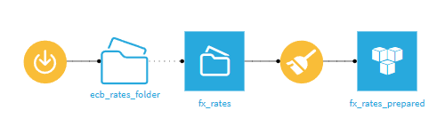

# Module 0 — Introduction à Dataiku

## 1. Introduction et objectifs

Ce module introductif a pour but de replacer l’atelier Dataiku dans le contexte plus large de la data science appliquée à la finance.  
Il présente l’environnement de travail, les fondements de la plateforme Dataiku, et une démonstration de mise en route servant de base aux modules techniques suivants (scoring et détection de fraude).

**Objectifs pédagogiques**

- Comprendre la raison d'être et la philosophie de Dataiku.  
- Identifier les composants de l'interface et leur articulation.  
- Distinguer les différentes versions du produit et leurs usages.  
- Réaliser pas à pas la démo de création de projet et d'import de données.  
- Acquérir une vue d'ensemble du cycle de vie d'un projet de data science dans Dataiku.  

Les notions abordées ici seront mobilisées dans les modules 1 et 2 (scoring et détection de fraude).  

---

## 2. Contexte et positionnement de Dataiku

### 2.1. Origine et développement

**Dataiku** est une société française fondée à Paris en 2013 par **Florian Douetteau**, **Thomas Cabrol**, **Clément Stenac** et **Marc Batty**.  
Leur ambition initiale : rendre la data science collaborative, reproductibleet accessible, sans la limiter aux profils techniques..  

Le produit phare, **Dataiku DSS (Data Science Studio)**, est devenu une plateforme de référence pour la création, le déploiement et la gouvernance de projets analytiques et de machine learning à l'échelle d'une organisation.

### 2.2. Philosophie : “Democratize Data Science”

Dataiku se positionne comme un **environnement partagé** entre différents  profils :

- Les utilisateurs non techniques exploitent des **recipes visuelles**.  
- Les utilisateurs avancés peuvent intégrer du **code Python, R, SQL** au sein du même flux.  
- L'outil favorise la **traçabilité**, la **reproductibilité** et la **collaboration** à toutes les étapes.

Cette approche est dite **tech-agnostique** : Dataiku ne privilégie pas une technologie ou un langage particulier, mais agit comme une **couche d'orchestration** entre eux.

> Cette volonté de "démocratisation" soulève parfois des débats : on pourrait estimer que la simplification visuelle peut masquer la complexité réelle des choix analytiques. L’intérêt pédagogique de Dataiku réside donc dans sa capacité à concilier lisibilité et compréhension du code sous-jacent.

---

## 3. Écosystème du produit

### 3.1. Versions principales

| Version                                | Description                                                      | Public cible                                |
| -------------------------------------- | ---------------------------------------------------------------- | ------------------------------------------- |
| **Dataiku DSS (Desktop)**              | Version installée localement, gratuite pour un usage individuel. | Étudiants, indépendants.                    |
| **Dataiku Cloud Trial**                | Version cloud hébergée (essai gratuit 14 jours).                 | Formation, démonstration.                   |
| **Dataiku Cloud Enterprise / Managed** | Version complète pour entreprises (SaaS ou on-premise).          | Organisations, équipes pluridisciplinaires. |

### 3.2. Architecture logique

Un projet Dataiku est organisé autour de quatre concepts fondamentaux :

| Composant    | Rôle                                                    |
| ------------ | ------------------------------------------------------- |
| **Dataset**  | Source de données (fichier, base SQL, API, connecteur). |
| **Recipe**   | Opération de transformation ou de modélisation.         |
| **Flow**     | Vue d'ensemble du pipeline de traitement.               |
| **Scenario** | Automatisation ou planification d'exécutions.           |

Des modules complémentaires assurent l'intégration :  
- **Dashboards** (visualisation et restitution)  
- **LLM Recipes / Agents** (intégration de modèles de langage et IA générative)  
- **Project Library / Plugins** (extensibilité de l'environnement)

### 3.3. Connecteurs et interopérabilité

Dataiku dispose de connecteurs vers :  
- Bases de données : PostgreSQL, MySQL, Oracle, Snowflake, BigQuery.  
- Cloud storages : AWS S3, Azure Storage, Google Drive.  
- Services d'analyse : Tableau, Power BI, Qlik.  
- Environnements de développement : compatibilité directe avec **Python (venv ou conda)**, **R**, **Spark**, **SQL**.

Chaque projet peut disposer de son propre environnement virtuel isolé (**code environments**).

---

## 4. Démarche générale d'un projet Dataiku

1. **Ingestion des données**  
   (Upload, connecteur SQL, API).  
2. **Préparation et nettoyage**  
   (recipes visuelles ou code).  
3. **Analyse exploratoire**  
   (visualisations, statistiques descriptives).  
4. **Modélisation**  
   (AutoML, Python, R, deep learning).  
5. **Déploiement et automatisation**  
   (Scenarios, API Endpoints, Agents).  
6. **Gouvernance et monitoring**  
   (drift detection, audit, permissions).

> La transparence et la gouvernance sont au cœur de l'esprti de l’outil, mais certaines recettes internes restent partiellement voire totalement opaques ; le contrôle complet du code n’est donc pas toujours possible dans la version Cloud.

---

## 5. Démonstration — Taux de change BCE

### Jeu de données

- **Source :** Banque centrale européenne (BCE)  
- **Accès public :** [https://nbs.sk/export/en/exchange-rate/latest/csv](https://nbs.sk/export/en/exchange-rate/latest/csv)  
- **Format :** CSV (actualisé chaque jour ouvré vers 16:00 CET).  
- **Colonnes :** `Date`, `Currencies Rate`.

### Étapes de la démonstration

#### Étape 1 : création du projet

1. Se connecter sur <https://profile.dataiku.com/> puis **Start free trial → Dataiku Cloud**.  
2. Créer un projet nommé : 
   - Cliquer sur **New Project → Blank Project**.
   - **Name :** `Dataiku_Intro_[PrénomNom]`  
   - **Key :** `Intro_[initiales]`  
   - Cliquer sur **Create**.

#### Étape 2 : création d'un dossier de téléchargement automatique

1. Dans la vue **Flow**, cliquer sur **(Connect or create)/(+Add Item → Connect or create). Dans la catégorie Dataiku Managed → Folder**.  
2. Nommer le dossier : `ecb_rates_folder`.
3. Retourner dans le Flow. Vous observez maintenant un premier élement.
4. A partir du dossier sélectionné, appuyer sur (+) dans la barre latérale droite.
Un menu s'affiche vous proposant plusieurs options, tout d'abord pour gérer l'élément sélectionné, puis en dessous des recipes.
5. Nous souhaitons maintenant ajouter un fichier de données à ce fichier. Pour cela cliquer sur **Download** sous **Visual recipes**. Le download recipe va vous proposer de sélectionner un dossier. En l'occurence nous n'en avons qu'un, il le sélectionne donc automatiquement. Cliquer ensuite sur **Create recipe**.
6. On peut observer plusieurs options disponibles, mais celle qui nous intéresse est **+Add a first source**.
Dans le champ **URL**, coller :  
   ```
   https://nbs.sk/export/en/exchange-rate/latest/csv
   ```  
7. Ne rien changer et cliquer sur **Check** → vérifier qu'un fichier apparaît.  
8. En haut à droite, cliquer sur **Save** → **Run** en bas à gauche. 
Un "job" va être instancié pour effectuer le téléchargement de votre fichier. Attendre que celui-ci se termine, puis cliquer sur **View folder ecb_rates_folder**.

#### Étape 3 : création du dataset

1. Dans le **Flow**, cliquer sur **(+) Create Dataset**.  
2. Sélectionner le dossier `ecb_rates_folder`.  
3. Appuyer d'abord sur **Test & Get Schema**, puis **List Files**.
4. Laisser le fichier détecté par défaut.  
5. Nommer le dataset : **`fx_rates`**.  
6. Cliquer sur **Create** puis ouvrir le dataset.  

#### Étape 4 : exploration

1. Onglet **Explore** : visualiser les colonnes (`Date`,`USD (Taux de change)`, etc.).  
2. Vous pouvez voir que si l'on veut trier par `Rate` pour identifier les devises les plus fortes/faibles avec nos colonnes actuelles, cela reste compliqué.
Nous allons donc préparer nos données.

#### Étape 5 : préparation des données

1. Depuis le **Flow**, sélectionner `fx_rates` → **+ Recipe → Prepare**.  
2. Nommer la sortie : **`fx_rates_prepared`**.  
3. Dans l'éditeur Prepare (**+ Add a new step**):  
   - **Supprimer** les lignes vides s'il y en a. (**Remove/Keep rows where cell is empty**)
   - **Convertir les nombre en format 'Raw'** (**Convert number formats** pour IDR & KRW)
   - **Regrouper** les devises et leur valeur sous une colonne **Currency** et une colonne **Rate** (**Fold multiple columns** en cochant **Remove folded columns**)
   - **Créer** une nouvelle colonne :  
     ```
     Inverse_rate = 1 / Rate
     ```  
     (taux inverse, utile pour exprimer la valeur d'un EUR en devise locale). 
     (**Formula**) 
4. Exécuter la Recipe.  
5. Ouvrir `fx_rates_prepared` et vérifier les nouvelles colonnes.
6. Explorer les différents graphiques et leurs options sur **Charts**.

**Question :**  
- Quelle devise a actuellement le taux de conversion le plus élevé ?  
  <details><summary>💡</summary>La devise IDR (Roupie indonésienne)</details>

**Question :**  
- Pourquoi peut-il être utile de calculer le taux inverse ?  
  <details><summary>Réponse</summary>Parce qu'il permet d'exprimer le montant d'euros obtenu pour une unité de devise étrangère, ce qui facilite la comparaison dans les deux sens.</details>

#### Étape 6 : visualisation et tableau de bord

1. Passer à l'onglet **Dashboard**.  
2. Nommer le tableau de bord : **`fx_dashboard`**.  
3. Ajouter deux graphiques :  
   - **Bar chart :** `Currency` en x, `EUR_per_unit` en y.  
   - **Table :** liste complète des devises et des taux.
   - Jouer avec les différentes options du dashboard afin de présenter de la meilleure des manières vos données.  
4. Sauvegarder.

**Flow attendu :**  


---

## Vérification du Flow

Chaque nœud doit être connecté et nommé ainsi :
| Type           | Nom                         | Description                                 |
| -------------- | --------------------------- | ------------------------------------------- |
| Download |  | Permet le téléchargement du fichier CSV depuis un lien externe.
| Dossier   | `ecb_rates_folder`          | Contient le fichier CSV distant.            |
| Dataset        | `fx_rates`                  | Données brutes importées depuis le dossier. |
| Recipe Prepare | (output) `fx_rates_prepared` | Données nettoyées et enrichies.             |

<details>
  <summary><strong></strong></summary>

## 6. Transparence et approche « whitebox »

L'un des intérêts majeurs de Dataiku réside dans son approche **whitebox** :  
chaque transformation est traçable et documentée dans le Flow.

- Les **recipes** sont documentées et rejouables dans le **Flow**,  
- Les modèles exposent leurs **coefficients, métriques et graphes d'explicabilité**.  
- Les **scenarios** et **logs d'exécution** permettent de suivre les actions réalisées.  

Cette philosophie est particulièrement cruciale en **finance**, où la **traçabilité, la justification et la gouvernance des modèles** sont des obligations réglementaires (ex.: Bâle III, ESG).

### Comparatif - Dataiku vs autres outils data

Ce tableau situe Dataiku parmi d’autres outils de l’écosystème data.  
Il n'a pas vocation à être exhaustif mais à éclairer la notion de transparence (whitebox vs blackbox).

| Outil | Type principal | Approche | Niveau de transparence | Points forts | Limites |
|--------|----------------|-----------|-------------------------|---------------|----------|
| **Dataiku** | Plateforme de **data science** et **ML** | **Whitebox** (no-code & code-friendly) | Très élevé : traçabilité du Flow, explicabilité des modèles, logs, gouvernance | Collaboration, traçabilité, intégration Python/R, gouvernance | Nécessite un minimum de structure de projet |
| **Power BI** | Outil de **Business Intelligence (BI)** | **Semi-whitebox** (formules DAX visibles mais moteur partiellement opaque) | Moyenne : scripts Power Query transparents, moteur interne fermé | Visualisations interactives, intégration Microsoft, facilité d'usage | Explicabilité faible, logique de calcul fermée |
| **Qlik Sense / Qlik View** | **BI associatif** | **Semi-whitebox** (scripts ETL visibles, moteur propriétaire opaque) | ⚙️ Moyenne : logique de chargement lisible, algorithme associatif non documenté | Analyse associative rapide, exploration intuitive | Opaque sur le moteur interne et calculs mémoire |
| **Apache Hop** | Outil **ETL open source** | **Whitebox (open source)** | Élevée : workflows et scripts entièrement visibles | Transparence, flexibilité, extensibilité | Pas d'interface analytique ni AutoML |
| **Apache Doris** | **Base analytique distribuée (OLAP)** | **Whitebox (open source)** | Élevée côté code source, mais faible côté interface utilisateur | Performances massives, SQL analytique, open source | Réservé aux profils techniques, pas d'interface visuelle |
| **Apache NiFi** | Outil d'**ingestion et d'orchestration de flux** | **Whitebox (open source)** | Élevée : dataflows visibles, provenance et traçabilité natives | Ingestion en temps réel, connecteurs multiples, intégration avec Dataiku via API | Pas de moteur analytique intégré, courbe d'apprentissage initiale |

---

## 7. Perspectives métier

- Les taux de change publiés par la Banque centrale européenne constituent une **référence officielle** pour de nombreuses institutions financières.  
- Cette démonstration illustre comment un analyste peut :  
  - importer automatiquement des données ouvertes ;  
  - effectuer des transformations simples ;  
  - visualiser les résultats dans un tableau de bord interactif.  
- Aucune ligne de code n'est nécessaire pour produire une analyse quotidienne reproductible.

Dans un contexte financier, Dataiku aide à concilier :  
- **productivité** (automatisation des tâches répétitives)  
- **traçabilité** (suivi des transformations)  
- **interopérabilité** (intégration avec les systèmes bancaires)  
- **gouvernance** (documentation et audit)

> L'outil se distingue moins par la performance de ses modèles que par la fiabilité et la conformité de son processus analytique.

---

## 8. Ressources

- Présentation Dataiku : <https://www.dataiku.com/product/>  
- Documentation Dataiku : <https://doc.dataiku.com/>  
- Dataiku Academy (cours en ligne gratuits) : <https://academy.dataiku.com/>

</details>
---

<sub>[**Page d'accueil**](https://github.com/rsquaredata/atelier_dataiku/blob/main/README.md)</sub>
